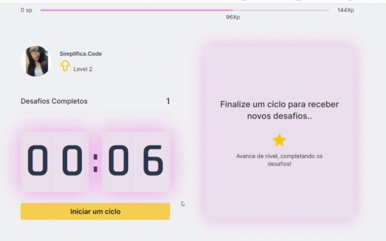

 >#  -Start Move

<h1>
    
</h1>

## ✅ Descrição:
O [ **Start Move** ](https://startmove.vercel.app/) foi idealizado com o objetivo de ajudar os usuários a ter melhor concentração durante suas tarefas, e ao final de um ciclo, um novo desafio é lançado e assim o usuário poderá realizar um exercicio fisico para descanso e após a conclusão ele podera confirmar se realizou e assim ganhar pontos e subir de nivel, O projeto foi construido durante o NLW da rocketseat🚀.

## ✅ Tecnologias:
- HTML
- CSS
- Typescript
- React 
- Next JS

## ✅ Como baixar o projeto:
```bash
#Como clonar o repositório
$git clone https://github.com/acrisandrade/startMove-NLW4

#Entrar no Diretório
$cd startMove-NLW4

#Instalar Dependencias
$npm install

#Iniciar Projeto
$npm run dev
````
## ✅ Contato:
>'Instagram:' [Simplfica.code](https://www.instagram.com/simplifica.code/?hl=pt-br)


